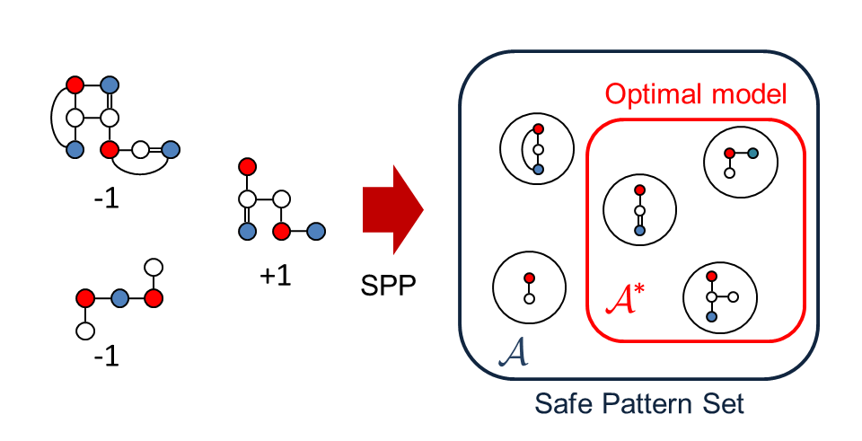

# SafePatternPruning: An Efficient Approach for Predictive Pattern Mining (KDD'16)



## Abstract
In this paper we study predictive pattern mining problems
where the goal is to construct a predictive model based on
a subset of predictive patterns in the database. Our main
contribution is to introduce a novel method called safe pat-
tern pruning (SPP) for a class of predictive pattern mining
problems. The SPP method allows us to efficiently nd a superset
of all the predictive patterns in the database that are
needed for the optimal predictive model. The advantage of
the SPP method over existing boosting-type method is that
the former can nd the superset by a single search over the
database, while the latter requires multiple searches. The
SPP method is inspired by recent development of safe fea-
ture screening. In order to extend the idea of safe feature
screening into predictive pattern mining, we derive a novel
pruning rule called safe pattern pruning (SPP) rule that can
be used for searching over the tree dened among patterns
in the database. The SPP rule has a property that, if a node
corresponding to a pattern in the database is pruned out by
the SPP rule, then it is guaranteed that all the patterns
corresponding to its descendant nodes are never needed for
the optimal predictive model. We apply the SPP method
to graph mining and item-set mining problems, and demonstrate
its computational advantage.

## Environmental Requirement
- gcc version 4.8.4
- GNU Make 3.81

## How to Compile
```
cd graphLasso (or graphSVM, itemLasso, itemSVM)
make
```

## Usage
`./train [option] [filename]`

### option
- -T : compute regularization path for a sequence of T \lambda evenly allocated between \lambda_0 and 0.01\lambda

- -F : calculate duality gap and dynamic screening every F iteration

- -S : minimum support (graph only)

- -D : maxdepth or maxpat

- -B : with bias (0 or 1)

### Example
`./train -T 100 -F 50 -D 3 -B 1 ./data/cpdb`

## Lisence
GNU General Public License
